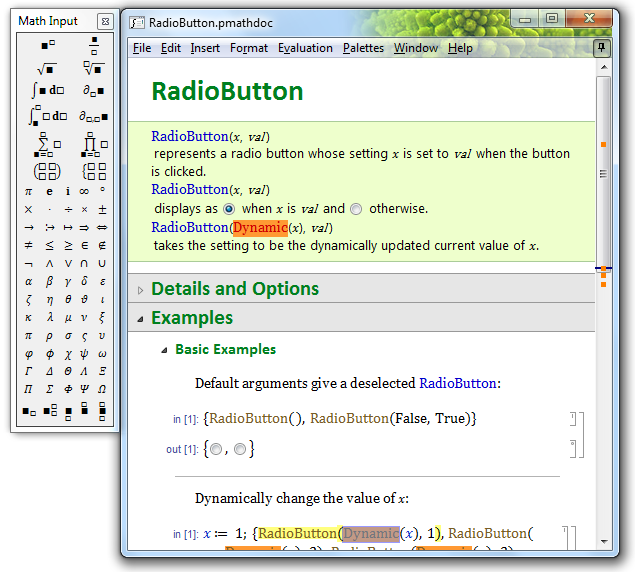

# pMath #

Copyright © Peter Frentrup, 2005-2019

*pMath* is an experimental computer algebra system/programming language.
Some concepts are similar to [Mathematica][] (usage of pattern matching, everything is an expression), but with improved syntax.
Development takes place on [BitBucket](https://bitbucket.org/pfrentrup/pmath).

## Build ##

The [Code::Blocks][] IDE is used for development.
Supported compilers are Visual C++ 2015 (Windows, recommended) and GCC (Windows, Unix).

### Prerequisites ###
When opening `pmath.workspace` for the first time, Code::Blocks will ask for many Global Variables. These correspond to required prebuild libraries. The variable names are of the form *name_32* or *name_64* for 32 and 64 bit flavors, respectively. You may choose to either only set the 32 bit versions or only the 64 bit versions or both. 
The relevant variables for the core *pMath* library are:

* **gmp_32**/**gmp_64** points to the [MPIR][] (Multiple Precision Integers and Rationals) installation directory.
  
    Set *include* to the include directory (containing gmp.h).  
    Set *lib* to the library directory (containing mpir.lib or libmpir.a).  
    Set *bin* to the binary directory (containing mpir.dll).

* **mpfr_32**/**mpfr_64** points to the [MPFR][] (Multiple Precision Floating-point with correct Rounding) installation directory.
  
    Set *include* to the include directory (containing mpfr.h).  
    Set *lib* to the library directory (containing mpfr.lib or libmpfr.a).  
    Set *bin* to the binary directory (containing mpfr.dll).

* **flint_32**/**flint_64** points to the [FLINT][] (Fast Library for Number Theory) installation directory.
  
    Set *include* to the include directory (containing flint.h).  
    Set *lib* to the library directory (containing dll_flint.lib or libflint.a).  
    Set *bin* to the binary directory (containing dll_flint.dll).

* **arb_32**/**arb_64** points to the [Arb][] (Arbitrary-precision interval arithmetic using Real Balls) installation directory.
  
    Set *include* to the include directory (containing arb.h).  
    Set *lib* to the library directory (containing arb.lib or libarb.a).  
    Set *bin* to the binary directory (containing arb.dll).

* **iconv_32**/**iconv_64** points to an [iconv][] installation directory for character set conversion. On Windows, [win_iconv][] is a good choice.
  
    Set *include* to the include directory (containing iconv.h).  
    Set *lib* to the library directory (containing iconv.lib or libiconv.a).  
    Set *bin* to the binary directory (containing iconv.dll).
	For Unix systems you can typically leave *bin* and *lib* empty because iconv is implemented by the standard library.

* **pcre_32**/**pcre_64** points to the [PCRE][] (Perl Compatible Regular Expressions) installation directory.
  
    Set *include* to the include directory (containing pcre.h).  
    Set *lib* to the library directory (containing pcre16.lib or libpcre16.a).  
    Set *bin* to the binary directory (containing pcre16.dll).

* **zlib_32**/**zlib_64** points to the [zlib][] installation directory for compression.
  
    Set *include* to the include directory (containing zlib.h).  
    Set *lib* to the library directory (containing zlib.lib or libzlib.a).  
    Set *bin* to the binary directory (containing zlib.dll).

The graphical front-end *richmath* uses the [Cairo][] graphics library together with the Win32 API on Windows and Gtk on Linux.

### Building the required libraries from source on Windows ###
It is recommended to use Visual C++ 2015 (MSVC for short) to build the libraries.
For MPIR and MPFR there are MSVC projects available at [http://www.github.com/BrianGladman/mpir]() and [http://www.github.com/BrianGladman/mpfr](), respectively.

[Mathematica]:  https://en.wikipedia.org/wiki/Mathematica
[Code::Blocks]: http://www.codeblocks.org/
[MPIR]:         http://mpir.org/
[MPFR]:         http://www.mpfr.org/
[FLINT]:        http://www.flintlib.org/
[Arb]:          http://arblib.org/
[iconv]:        https://en.wikipedia.org/wiki/Iconv
[win_iconv]:    https://github.com/win-iconv/win-iconv
[PCRE]:         http://www.pcre.org/
[zlib]:         http://www.zlib.net/
[cairo]:        https://www.cairographics.org
